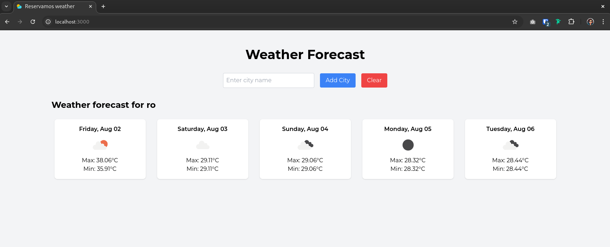

# Reservamos Weather App

This project is a web application that allows users to compare the weather forecast for the next 5 days, by day, of different destinations offered by Reservamos. Users can input the names of cities and see the maximum and minimum temperatures for these places.

# Features

- Compare the weather forecast for multiple cities for the next 5 days.
- Display weather information.
- Add multiple cities to compare their weather.
- Clear the search to reset the city list and weather data.

# Technologies Used

- Next.js
- React
- Tailwind CSS
- SCSS
- Axios
- OpenWeather API
- Reservamos API

# Getting Started

## Prerequisites

Ensure you have the following installed on your local machine:
- Node.js (v14.x or later)
- npm (v6.x or later)

## Installation

1. Clone the repository:
`git clone https://github.com/Daffyta/reservamos-challenge.git`
`cd reservamos-weather`

2. Install dependencies:
`npm install`

3. Create a **.env.local** file in the root directory and add your OpenWeather API key:
`NEXT_PUBLIC_OPENWEATHER_API_KEY=openweather_api_key`

Replace **'openweather_api_key'** with your OpenWeather API key.

## Running the Application
To run the application locally, use the following command:

`npm run dev`

This will start the development server on **'http://localhost:3000'**. Open your browser and navigate to this URL to see the application.

# Usage

1. Enter the name of a city in the input field.
2. Click the "Add City" button to add the city's weather forecast to the comparison list.
3. Repeat steps 1 and 2 to add more cities.
4. Click the "Clear" button to reset the list of cities and weather data.

## Reference:
